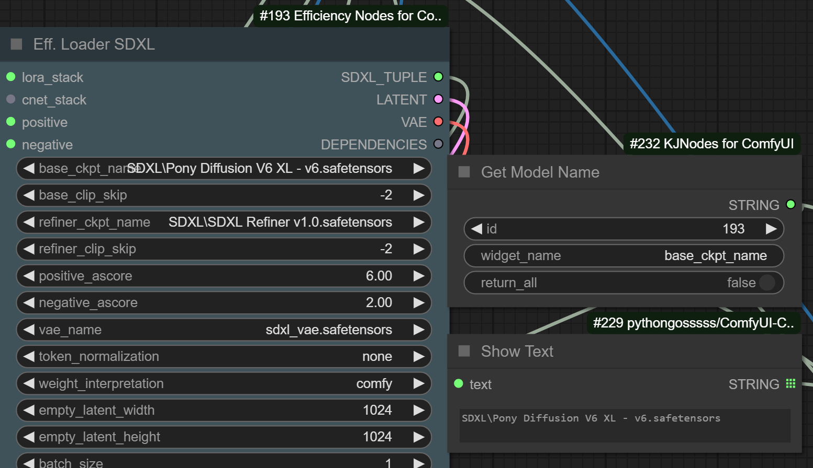
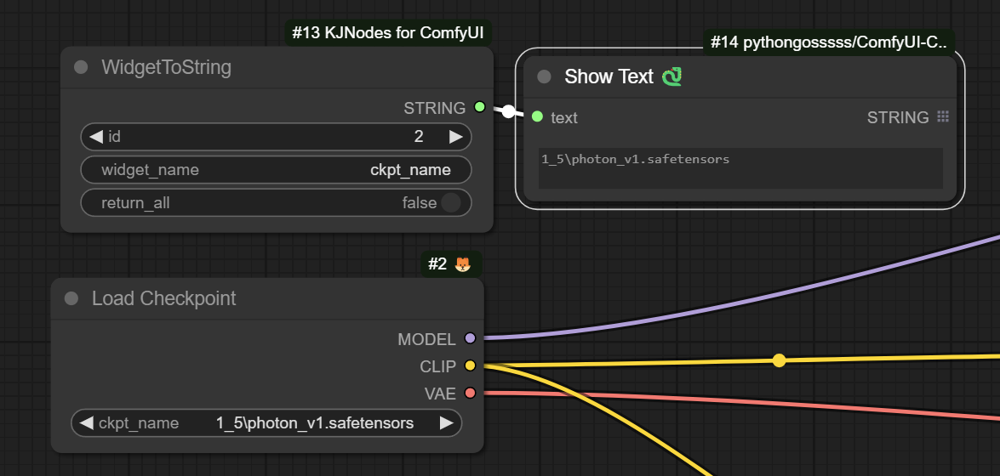

# KJNodes for ComfyUI

Various quality of life and masking related -nodes and scripts made by combining functionality of existing nodes for ComfyUI.

# Installation
1. Clone this repo into `custom_nodes` folder.
2. Install dependencies: pip install -r requirements.txt

## Javascript

### browserstatus.js
Sets the favicon to green circle when not processing anything, sets it to red when processing and shows progress percentage and the lenghth of your queue. Might clash with other scripts that affect the page title, delete this file to disable (until I figure out how to add options).

## Nodes:

### Set/Get

Javascript nodes to set and get constants to reduce unnecessary lines. Takes in and returns anything, purely visual nodes.
Could still be buggy, especially when loading workflow with missing nodes, use with precaution.

### ColorToMask

RBG color value to mask, works with batches and AnimateDiff.

### ConditioningMultiCombine

Combine any number of conditions, saves space.

### ConditioningSetMaskAndCombine

Mask and combine two sets of conditions, saves space.

### GrowMaskWithBlur

Grows or shrinks (with negative values) mask, option to invert input, returns mask and inverted mask. Additionally Blurs the mask, this is a slow operation especially with big batches.

### CreateFadeMask

This node creates batch of single color images by interpolating between white/black levels. Useful to control mask strengths or QR code controlnet input weight when combined with MaskComposite node.

### CreateAudioMask

Work in progress, currently creates a sphere that's size is synced with audio input.

### WidgetToString
Outputs the value of a widget on any node as a string

Enable node id display from Manager menu, to get the ID of the node you want to read a widget from:

Use the node id of the target node, and add the name of the widget to read from

Recreating or reloading the target node will change its id, and the WidgetToString node will no longer be able to find it until you update the node id value with the new id.
